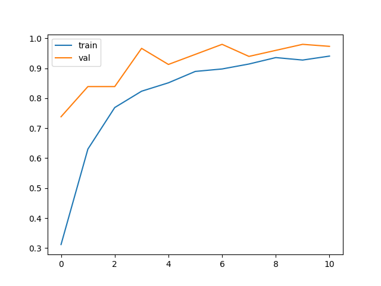

# 🦎 Gecko Identification using Pattern Recognition

This project focuses on **classifying and identifying different gecko species** using **image pattern recognition**.  
The model analyzes **dot structures, colors, and textures** on gecko skin to differentiate between 5 species.  

---

## 🔹 Features
- 📊 **Dataset**: ~120 images per class (after augmentation).  
- 🧠 **Model**: CNN (Convolutional Neural Network) trained on augmented dataset.  
- 🔍 **Goal**: Classify gecko species accurately based on visual patterns.  
- ✅ **Result**: Successful predictions on test images with good accuracy.  

---

## 🔹 Technologies Used  

| Tech Stack             | Description                                |
|------------------------|--------------------------------------------|
| **Python**             | Core programming language                  |
| **TensorFlow / Keras** | Deep learning framework for model building |
| **NumPy**              | Numerical computations & arrays            |
| **OpenCV**             | Image processing & computer vision         |
| **Matplotlib**         | Data visualization & plotting              |

---

## 🔹 Project Workflow
1. Data collection & preprocessing  
2. Data augmentation to increase sample size  
3. Model building using CNN  
4. Training & evaluation  
5. Testing on unseen images  

---

## 🔹 Evaluation
- We are training and validating the model on the augmented data  set which gives us the accuraccy of 98%.
- When we test the model using the original dataset, the accuraccy coming is 96% which is an extremely good outcome.

---

## 🔹 Future Scope
- 📈 Train with larger datasets for higher accuracy  
- 🤖 Apply transfer learning (e.g., ResNet, VGG16)  
- 🌐 Deploy as a web or mobile application for real-time classification  

---
